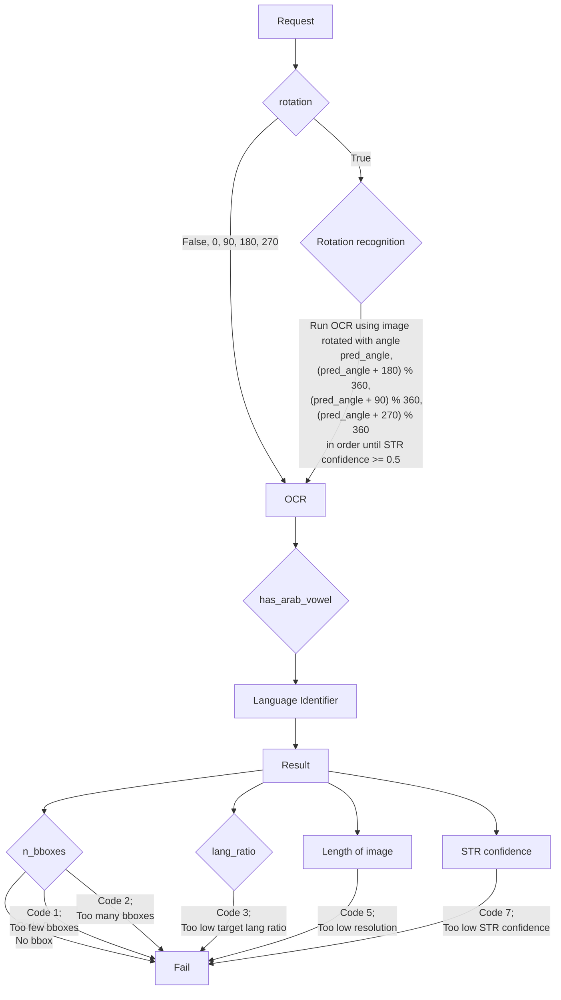

- 회사에서 운영하는 크라우드 소싱 데이터 수집 플랫폼을 통해 scene text images를 수집하는 프로젝트에서 image processing 알고리즘들을 통해 이미지에 대한 검수를 자동화하고 있습니다.
- 자동 검수를 통과하지 못한 이미지에 한해서는 수동 검수를 진행합니다.

# Requirements
- 세부 프로젝트에 따라 이미지의 조건이 달라지지만 그 중 하나를 예로 들어 본다면 다음과 같습니다.

# Process
1. 이미지 접수 (`qc_pipeline`)
    - image_url	string	null	분석할 이미지의 s3 URL
    - image_id	int	null	이미지의 고유 id
    - image_src	string	null	이미지 수집 소스: "arcade", "b2b", "vender" 등
    - project	string	null	이미지 수집 프로젝트명 "naver_arabic_image" 등
    - target_lang	string	"ar"	분석 대상 언어
    - similarity	float	0.95	이미지 유사도 점수 제한치 (0.0에서 1.0까지)
        - 같은 project 내의 유사 이미지로 검색 제한
    - lang_ratio	float	0.5	대상 언어 박스 비율 (0.0에서 1.0까지)
    - rotation	boolean / int	true	QC 중 이미지 회전 적용 유무
        - true: 방위 탐지 후 회전 적용
        - false  : 회전 미적용
        - 정수값(0, 90, 180, 270): 해당 방위로 이미지 회전(시계방향) 후 QC
        - (0 = false )
    - n_box_range	array of integers	[1, 10000]	상자의 최소 및 최대 수
    - box_info	boolean	false	상자 별 세부 정보 요청
1. QC (`perform_image_qc`)
    - Remove image metadata
    - Perform rotation recognition and OCR
    - `if rotation in [False, 0, 90, 180, 270]`:
        - 해당 각도 (`False`일 경우 0도)로 이미지 회전 후 OCR 구동
    - 그 외
        - rotation recognition 후 4 방향 OCR
        ```python
        pred_angle, rot_score = self.check_rotation(image)
        test_angles = [
            pred_angle,
            (pred_angle + 180) % 360,
            (pred_angle + 90) % 360,
            (pred_angle + 270) % 360,
        ]
        ```
        - 4 방향 OCR 중 score가 0.5 이상인 각도가 나오면 중단하고 이 각도를 `best_angle`로 지정
1. Update
    - `best_angle`에 따라 회전된 이미지를 DB에 삽입 또는 갱신 & 이 이미지의 임베딩이 추가된 fai
    - 기존 DB에 저장된 이미지와 유사도 검사
1. Back-up
## Flow Chart
