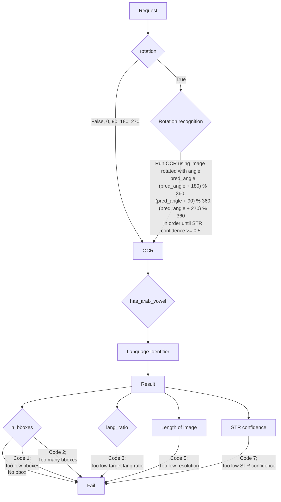

- 회사에서 운영하는 크라우드 소싱 데이터 수집 플랫폼을 통해 scene text images를 수집하는 프로젝트에서 image processing 알고리즘들을 통해 이미지에 대한 검수를 자동화하고 있습니다.
- 자동 검수를 통과하지 못한 이미지에 한해서는 수동 검수를 진행합니다.

# Requirements
- 세부 프로젝트에 따라 이미지의 조건이 달라지지만 그 중 하나를 예로 들어 본다면 다음과 같습니다.
    - 기존에 수집된 이미지 중에 대상 이미지와 유사한 것이 없을 것
    - 바운딩 박스의 개수와 일정 범위에 들어올 것
    - 수집하고자 하는 언어 (e.g., 아랍어)에 해당하는 바운딩 박스가 일정 비율 이상일 것
    - 이미지 내 텍스트에 개인정보가 포함되지 않을 것
    - 이미지 내 텍스트가 사람이 읽을 수 있는 정도로 명확할 것
    - 각 카테고리에 맞는 이미지일 것
    - 모음 포함?
    - 디스플레이를 촬영하거나 캡쳐한 이미지가 아닐 것
    - OCR confidence가 낮지 않은 이미지일 것?

# Process
1. 이미지 접수
2. Google vision OCR
    - 부적절한 이미지 반려
3. 자동 QC
    1. Fail 없음
        1. 모음 포함 카테고리에 속하면 모음 포함 시 자동 QC 통과
        2. 모음 포함 카테고리에 속하지 않으면 자동 QC 통과
    2. Fail 존재
        1. 자동 QC 기각
        2. (2) 박스 과다, (7) OCR confidence 낮음: 수동 QC 대기 상태 돌입
        3. 나머지: 종료

1. 이미지 접수 (`qc_pipeline`)
    - image_url	string	null	분석할 이미지의 s3 URL
    - image_id	int	null	이미지의 고유 id
    - image_src	string	null	이미지 수집 소스: "arcade", "b2b", "vender" 등
    - project	string	null	이미지 수집 프로젝트명 "naver_arabic_image" 등
    - target_lang	string	"ar"	분석 대상 언어
    - similarity	float	0.95	이미지 유사도 점수 제한치 (0.0에서 1.0까지)
        - 같은 project 내의 유사 이미지로 검색 제한
    - lang_ratio	float	0.5	대상 언어 박스 비율 (0.0에서 1.0까지)
    - rotation	boolean / int	true	QC 중 이미지 회전 적용 유무
        - true: 방위 탐지 후 회전 적용
        - false  : 회전 미적용
        - 정수값(0, 90, 180, 270): 해당 방위로 이미지 회전(시계방향) 후 QC
        - (0 = false )
    - n_box_range	array of integers	[1, 10000]	상자의 최소 및 최대 수
    - box_info	boolean	false	상자 별 세부 정보 요청
1. QC (`perform_image_qc`)
    - Remove image metadata
    - Perform rotation recognition and OCR
    - `if rotation in [False, 0, 90, 180, 270]`:
        - 해당 각도 (`False`일 경우 0도)로 이미지 회전 후 OCR 구동
    - 그 외
        - rotation recognition 후 4 방향 OCR
        ```python
        pred_angle, rot_score = self.check_rotation(image)
        test_angles = [
            pred_angle,
            (pred_angle + 180) % 360,
            (pred_angle + 90) % 360,
            (pred_angle + 270) % 360,
        ]
        ```
        - 4 방향 OCR 중 score가 0.5 이상인 각도가 나오면 중단하고 이 각도를 `best_angle`로 지정
1. Update
    - `best_angle`에 따라 회전된 이미지를 DB에 삽입 또는 갱신 & 이 이미지의 임베딩이 추가된 fai
    - 기존 DB에 저장된 이미지와 유사도 검사
1. Back-up
## Flow Chart


# 설명 듣기
- 애초에 네이버 파파고의 아랍어 이미지 수집 프로젝트를 염두에 두고 시작했던 프로젝트
- 납품 물량 한 달에 10,000장
- 모음 표기
    - 아랍어는 모음을 표기하지 않는 경우가 많음 (초성체처럼 김종범->ㄱㅈㅂ)
    - 모음 있는 표기는 모음이 하나라도 있다면 전체가 다 있을 것
- 요구조건
    - 다양한 배경!!
    - 장축 1,280px
    - OCR (박싱 + 전사)
    - 박스 20 ~ 30개 (단어별로)
    - 텍스트는 언어 관계 없이 전부 다 디텍션
    - 타겟 언어 외는 돈 케어로 전사
    - 개인정보, 저작권
- 모국어가 아랍어인 유저만 참가 가능
- 카테고리 (8개)
    - 모음이 포함된 이미지
    - 가게 간판
    - 표지판 (교통 표지판, 안내문 등)
    - 메뉴 (인쇄물, 손글씨 등)
    - 잡지 커버
    - 광고 (포스터, 전단지 등)
    - 제품 포장(뒷면) : 영양/제품 정보 등
    - 제품 포장(앞면) : 병, 제품 상자 등

- 텍스트
    - 대화하기
    - 전사
    - 번역
- 음성
    - 이벤트

- 이미지 업로드하면 바로 자동 QC 보냄
- 이때 안 돌아갔으면 매일 아침 정해진 시간에 자동 QC 보냄
